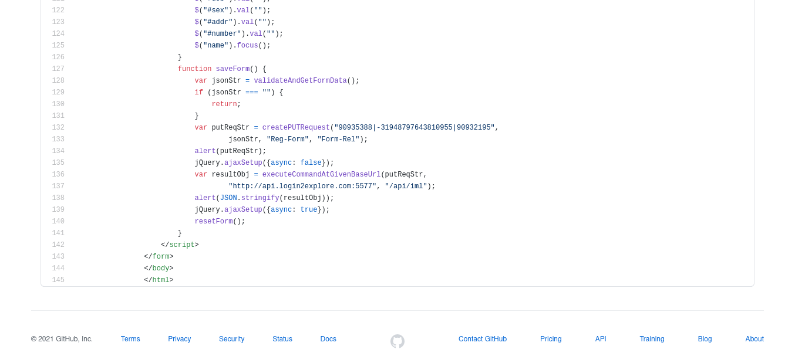

# Important Info
This project based on JPDB so you have to create account on http://login2explore.com page.
After creating account you just have to login with your Login credentials and after that create token.
Copy that token in this project where token belongs and change the Database name and Database relation becuase this project contains my token and my Database.

# ScreenShot

In above Screenshot change token and DB.
This screenshot was created from index.html page just go in that source code file and change it.

## Good Luck
