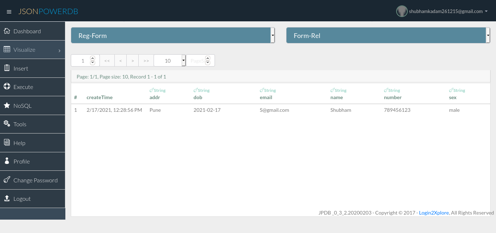
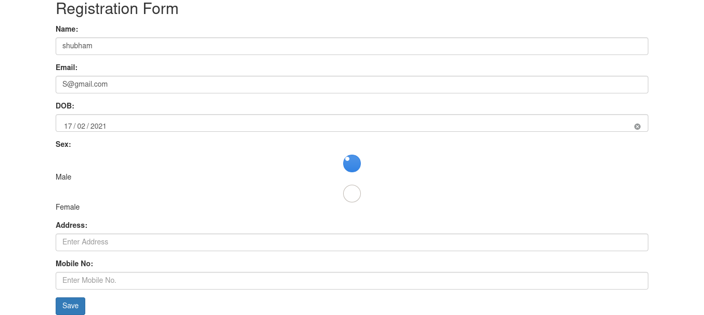

# Registration Form
Code sample utilizing jQuery, JPDB andJS. Uses copious amounts of HTML5 and CSS3.
## "This is a Simple Registration Form"
### About Project: <h3>
This is Registration Form project based On JPDB(Json Power DataBase),HTML and JS.
It containt normal attributes like Name,Email,Address & DoB etc.
It connected to JPDB Which handels the Data storing Part.
The registration form is refreshed after saving the data.

# JsonPowerDB
### About JsonPowerDB:
JsonPowerDB is a Database Server with Developer friendly REST API services. It's a High Performance, Light Weight, Ajax Enabled, Serverless, Simple to Use, Real-time Database.

Easy and fast to develop database applications without using any server side programming / scripting or without installing any kind of database.

### Benefits of using JsonPowerDB:
* Simplest way to retrieve data in a JSON format.
* Schema-free, Simple to use, Nimble and In-Memory database.
* It is built on top of one of the fastest and real-time data indexing engine - PowerIndeX.
* It is low level (raw) form of data and is also human readable.
* It helps developers in faster coding, in-turn reduces development cost.

### Release History
* Ver 0.0.1
   * Work In Progress (With atractive GUI)

# ScreenShots:

